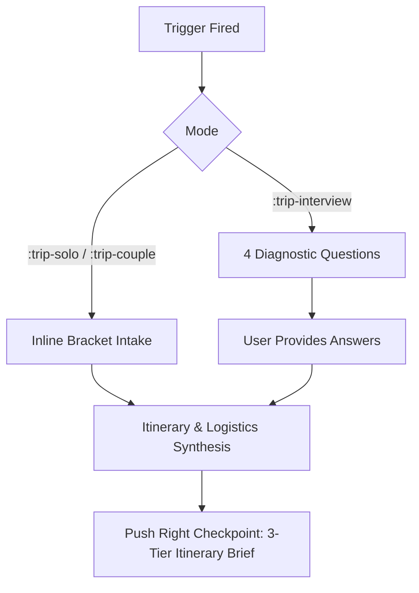
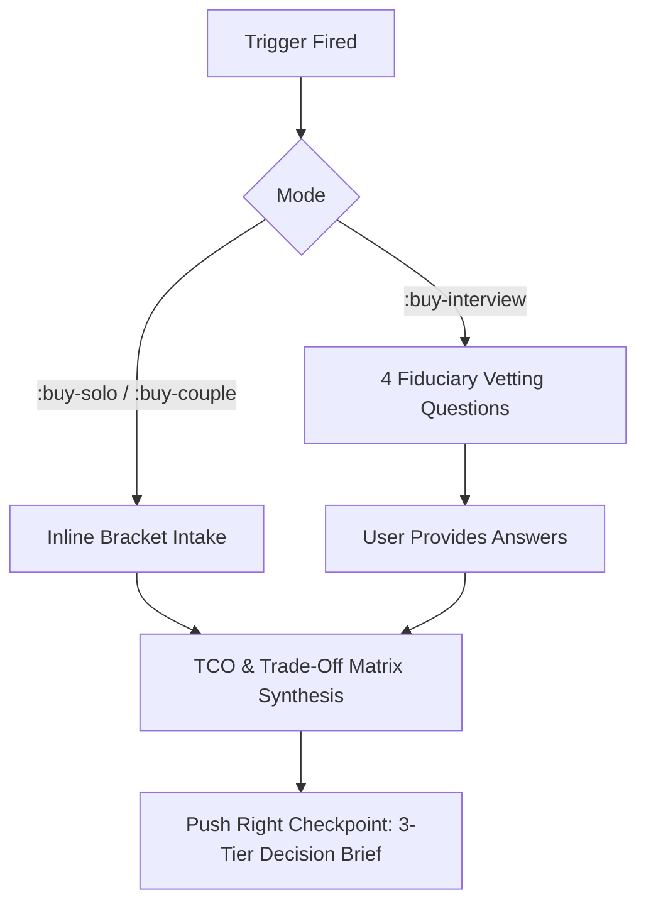

# Workflow: Concierge System (Trip Planning & Buyer Decision Loop)

## 1. Overview & Loop Definition
A high-efficiency decision architecture and concierge loop designed for two recurring, high-friction personal activities:
1. **Travel Engineering**: Designing friction-free, context-aware travel itineraries for solo travelers and couples with asymmetric pace or dietary preferences.
2. **Purchase Vetting**: Rigorous consumer ombudsman and fiduciary buyer advisory for solo purchases and joint big-ticket acquisitions, systematically eliminating buyer's remorse.

- **Loop Cadence**: On-demand / Event-driven (pre-travel or pre-purchase evaluation).
- **Implementer Target**: Frontier reasoning LLM or AI Concierge Agent.
- **Core Philosophy**: Zero popup forms; fast direct text expansion; push checkpoints right by delivering decision-ready 3-tier executive briefs instead of conversational fluff.

---

## 2. Triggers
All triggers are event-driven Espanso shortcuts residing in the `prompts` package (`prompts/_concierge.yml`):

| Domain | Scope | Trigger | Interaction Model |
| :--- | :--- | :--- | :--- |
| **Trip** | Solo Traveler | `:trip-solo` | Direct replace with inline brackets `[...]` and cursor at destination |
| **Trip** | Couple / Duo | `:trip-couple` | Direct replace with dual-profile brackets (Person A vs Person B) |
| **Trip** | Diagnostic Probing | `:trip-interview` | Diagnostic prompt; AI asks 4 precise questions before drafting itinerary |
| **Buyer** | Solo Purchase | `:buy-solo` | Direct replace with inline brackets (item, budget, frequency, candidates) |
| **Buyer** | Joint / Co-Buyer | `:buy-couple` | Direct replace with dual-criteria brackets (Partner A vs Partner B priorities) |
| **Buyer** | Adversarial Vetting| `:buy-interview` | Adversarial fiduciary prompt; AI asks 4 vetting questions before verdict |

---

## 3. Workflow Pipeline & Stages

### Domain A: Trip Concierge Pipeline



#### Stage T1: Intake & Asymmetry Balancing
- **Solo Mode**: Balances destination, duration, budget band, travel tempo (e.g. dawn explorer vs cafe lounger), and non-negotiables.
- **Couple Mode**: Actively reconciles asymmetric partner profiles:
  - Morning pace & energy cycles (early riser vs slow morning).
  - Dietary exclusions and culinary priorities.
  - Vibe alignment (adventure/culture vs relaxation/luxury).
  - Identifies "parallel play" opportunities where each partner explores independently without friction.

#### Stage T2: Diagnostic Interrogation (Interview Mode Only)
If invoked via `:trip-interview`, the concierge pauses and asks **exactly 4 diagnostic questions**:
1. **Pacing & Energy**: What is your morning rhythm and walking tolerance (miles/day)?
2. **Budget Ceiling & Splurges**: What is your total budget ceiling, and where do you want to splurge vs save?
3. **Sensory & Environmental Dealbreakers**: What noise, crowd, or climate factors ruin an experience for you?
4. **Must-Have Core Anchor**: What is the single experience that would make this trip a 10/10 success?

#### Stage T3: 3-Tier Itinerary Brief Synthesis
The concierge synthesizes all inputs into the standardized decision brief (detailed in Section 4).

---

### Domain B: Buyer Concierge Pipeline



#### Stage B1: Intake & Friction Analysis
- **Solo Mode**: Examines product category, target budget ceiling, realistic usage frequency, and top contenders.
- **Couple Mode**: Acts as a neutral consumer ombudsman balancing competing criteria:
  - Partner A values (e.g. aesthetic design, immediate convenience, quiet operation).
  - Partner B values (e.g. technical specs, longevity, budget ceiling, resale value).
  - Flags compromise zones to avert co-buyer resentment.

#### Stage B2: Adversarial Interrogation (Interview Mode Only)
If invoked via `:buy-interview`, the concierge acts as an adversarial fiduciary and asks **exactly 4 vetting questions**:
1. **Usage Reality & Storage**: How many times per week/month will you realistically use this after 60 days, and where will it physically live?
2. **Total Cost of Ownership (TCO)**: What are the hidden costs (maintenance, accessories, subscriptions, proprietary consumables)?
3. **Downgrade & Used Feasibility**: Could a refurbished unit, previous-generation model, or rental deliver 90% of the utility at 50% of the price?
4. **Regret Trigger & Exit Route**: What is the return window, and what specific failure mode would cause immediate buyer's remorse?

#### Stage B3: 3-Tier Decision Brief Synthesis
The concierge delivers the verdict and trade-off breakdown.

---

## 4. Checkpoints (Push Right)
In accordance with the loop-me philosophy, human checkpoints are deferred to the furthest possible boundary. The user is not badgered with intermediate clarifying messages unless in an interview mode. Outputs are always formatted as high-density, decision-ready briefs.

### Checkpoint Format 1: Trip Itinerary Brief
```markdown
### 1. Logistical Snapshot
- **Base / Neighborhood**: [Recommended base with transit rationale]
- **Daily Pace**: [e.g. 1 major anchor + 1 flexible afternoon block]
- **Estimated Daily Budget**: [Realistic daily spend band excluding lodging]

### 2. Day-by-Day Flow
- **Day 1**: [Morning Anchor] | [Afternoon Rest/Flex] | [Evening Dinner & Neighborhood]
- **Day 2**: ...
*(Includes explicit rest buffers and accommodates both paces)*

### 3. Actionable Checklist
- [ ] Advance Booking #1 (High-demand reservation/train)
- [ ] Advance Booking #2
- [ ] Logistics/Packing Warning (Transit pass, footwear, seasonality trap)
```

### Checkpoint Format 2: Buyer Decision Brief
```markdown
### 1. Bottom-Line Verdict
- **Verdict**: [BUY NOW / BUY USED OR PREVIOUS-GEN / WAIT FOR SALE / PASS IN FAVOR OF ALTERNATIVE]
- **Top Recommendation**: [Specific Make / Model / Variant]
- **Maximum Price to Pay**: [$X.XX ceiling]

### 2. Trade-Off & TCO Matrix
| Dimension | Candidate A | Candidate B | The Sweet Spot |
| :--- | :--- | :--- | :--- |
| Initial Cost vs TCO | ... | ... | ... |
| Durability / Lifespan | ... | ... | ... |
| Co-Buyer Alignment | ... | ... | ... |

### 3. Regret Shield
- **Hidden Catch**: [The single biggest annoyance or recurring cost]
- **Protection Strategy**: [How to mitigate the catch or optimal return terms]
```

---

## 5. Associated Espanso Shortcuts
- Package: `prompts`
- Submodule: `prompts/_concierge.yml`
- Root import: `prompts/package.yml`
